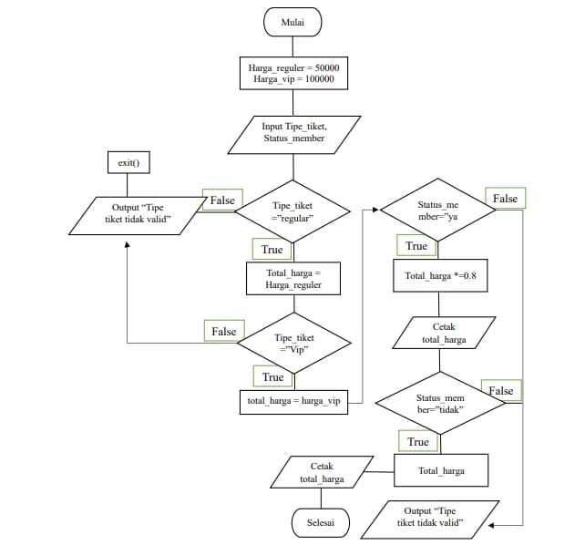
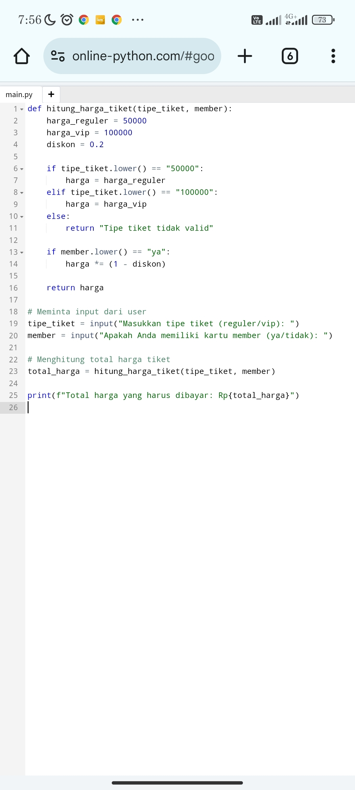
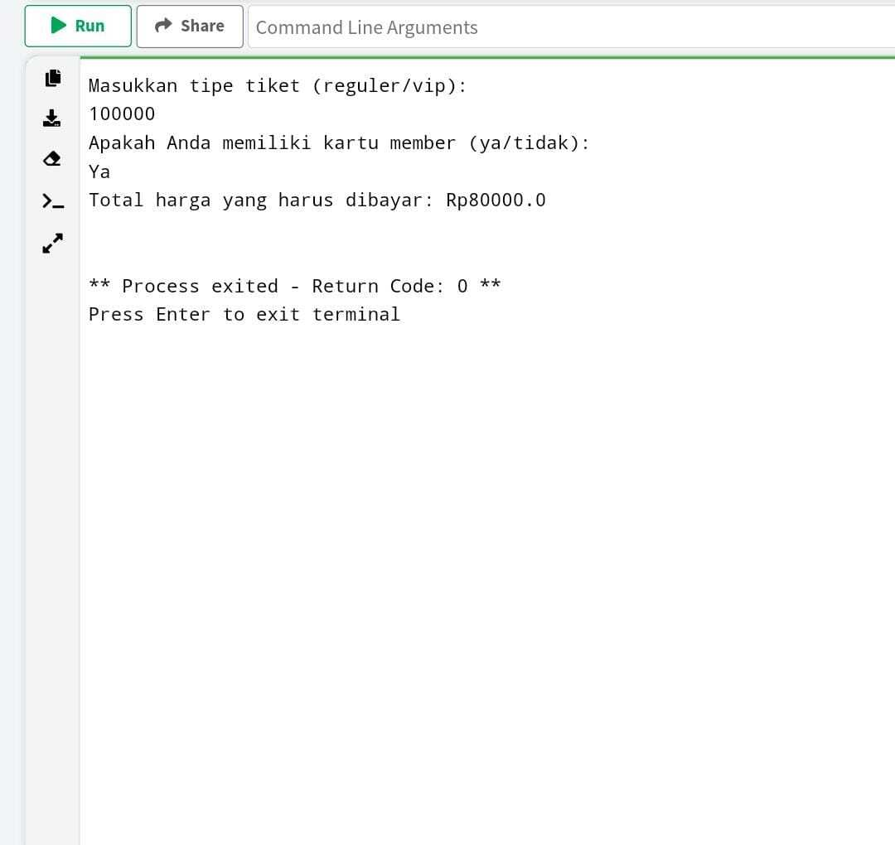

Nama : Fauzan giri Wardana 
Nim. : 312410535
kelas: TI24A5 

Flowchart:

def hitung_harga_tiket(tipe_tiket, member):
    harga_reguler = 50000
    harga_vip = 100000
    diskon = 0.2

    if tipe_tiket.lower() == "50000":
        harga = harga_reguler
    elif tipe_tiket.lower() == "100000":
        harga = harga_vip
    else:
        return "Tipe tiket tidak valid"

    if member.lower() == "ya":
        harga *= (1 - diskon)

    return harga

# Meminta input dari user
tipe_tiket = input("Masukkan tipe tiket (reguler/vip): ")
member = input("Apakah Anda memiliki kartu member (ya/tidak): ")

# Menghitung total harga tiket
total_harga = hitung_harga_tiket(tipe_tiket, member)

print(f"Total harga yang harus dibayar: Rp{total_harga}")

Penjelasan Program

1). Definisi Fungsi hitung_harga_tiket:

Fungsi ini menerima dua argumen: tipe_tiket dan member.

harga_reguler dan harga_vip adalah variabel yang menyimpan harga tiket reguler dan VIP.

diskon adalah variabel yang menyimpan nilai diskon 20% (0.2).

2). Pengecekan Tipe Tiket:

Jika tipe_tiket adalah "reguler", maka harga ditetapkan sebagai harga_reguler.

Jika tipe_tiket adalah "vip", maka harga ditetapkan sebagai harga_vip.

Jika tipe_tiket tidak valid, fungsi akan mengembalikan pesan error.

3). Pengecekan Status Member:

Jika member adalah "ya", maka harga akan dikalikan dengan (1 - diskon), yaitu 80% dari harga asli.

4). Meminta Input dari User:

Program meminta user untuk memasukkan tipe tiket dan status member.

5). Menghitung dan Menampilkan Harga:

Menghitung total harga berdasarkan input user dan menampilkannya

## Beginilah tampilan flowchart yang di buat menjadi program python

### Beginilah hasil hasil eksekusi dari program python di atas

