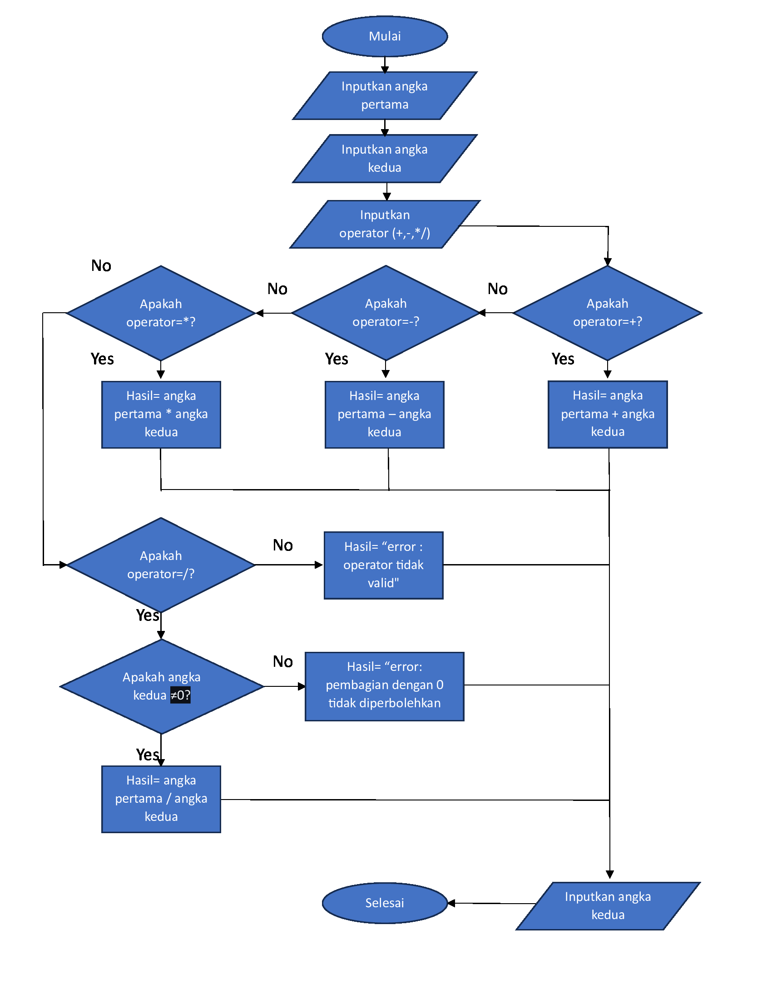
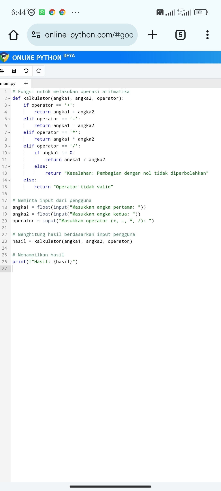
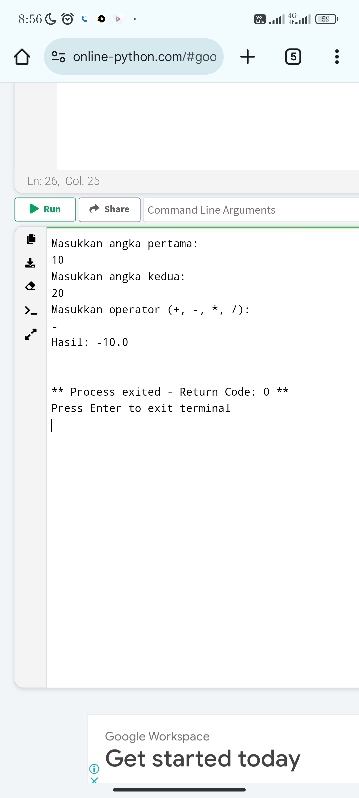
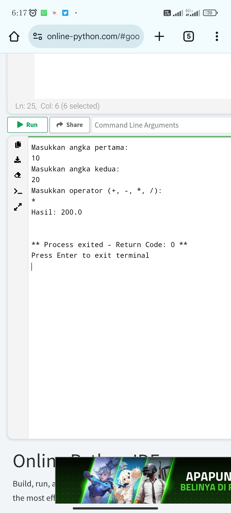
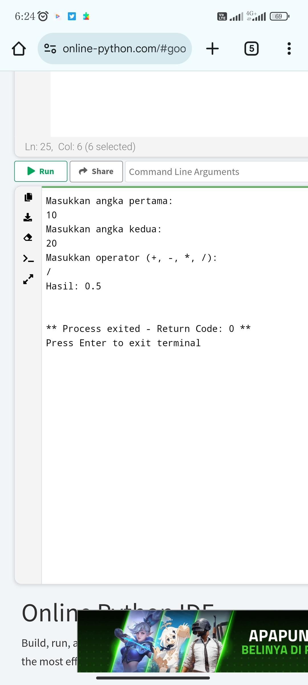
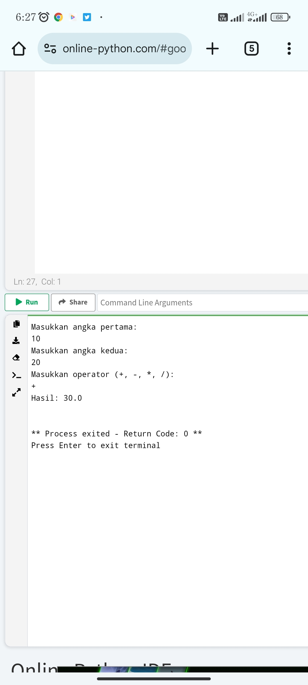

Nama : Fauzan giri Wardana 
Nim. : 312410535
kelas: TI24A5 

Flowchart:

def hitung_harga_tiket(tipe_tiket, member):
    harga_reguler = 50000
    harga_vip = 100000
    diskon = 0.2

    if tipe_tiket.lower() == "50000":
        harga = harga_reguler
    elif tipe_tiket.lower() == "100000":
        harga = harga_vip
    else:
        return "Tipe tiket tidak valid"

    if member.lower() == "ya":
        harga *= (1 - diskon)

    return harga

# Meminta input dari user
tipe_tiket = input("Masukkan tipe tiket (reguler/vip): ")
member = input("Apakah Anda memiliki kartu member (ya/tidak): ")

# Menghitung total harga tiket
total_harga = hitung_harga_tiket(tipe_tiket, member)

print(f"Total harga yang harus dibayar: Rp{total_harga}")

# Penjelasan Program

1). Definisi Fungsi hitung_harga_tiket:

Fungsi ini menerima dua argumen: tipe_tiket dan member.

harga_reguler dan harga_vip adalah variabel yang menyimpan harga tiket reguler dan VIP.

diskon adalah variabel yang menyimpan nilai diskon 20% (0.2).

2). Pengecekan Tipe Tiket:

Jika tipe_tiket adalah "reguler", maka harga ditetapkan sebagai harga_reguler.

Jika tipe_tiket adalah "vip", maka harga ditetapkan sebagai harga_vip.

Jika tipe_tiket tidak valid, fungsi akan mengembalikan pesan error.

3). Pengecekan Status Member:

Jika member adalah "ya", maka harga akan dikalikan dengan (1 - diskon), yaitu 80% dari harga asli.

4). Meminta Input dari User:

Program meminta user untuk memasukkan tipe tiket dan status member.

5). Menghitung dan Menampilkan Harga:

Menghitung total harga berdasarkan input user dan menampilkannya

## Beginilah tampilan flowchart yang di buat menjadi program python

### Beginilah hasil eksekusi dari program python di atas

Flowchart

# Fungsi untuk melakukan operasi aritmatika
def kalkulator(angka1, angka2, operator):
    if operator == '+':
        return angka1 + angka2
    elif operator == '-':
        return angka1 - angka2
    elif operator == '*':
        return angka1 * angka2
    elif operator == '/':
        if angka2 != 0:
            return angka1 / angka2
        else:
            return "Kesalahan: Pembagian dengan nol tidak diperbolehkan"
    else:
        return "Operator tidak valid"

# Meminta input dari pengguna
angka1 = float(input("Masukkan angka pertama: "))
angka2 = float(input("Masukkan angka kedua: "))
operator = input("Masukkan operator (+, -, *, /): ")

# Menghitung hasil berdasarkan input pengguna
hasil = kalkulator(angka1, angka2, operator)

# Menampilkan hasil
print(f"Hasil: {hasil}")

## Penjelasan Program
1).Fungsi kalkulator:

Fungsi ini menerima tiga parameter: angka1, angka2, dan operator.

Berdasarkan nilai operator, fungsi ini melakukan operasi aritmatika yang sesuai:

•Penjumlahan jika operator adalah '+'

•Pengurangan jika operator adalah '-'

•Perkalian jika operator adalah '*'

•Pembagian jika operator adalah '/'

Fungsi ini juga memeriksa apakah angka2 bukan nol sebelum melakukan pembagian untuk menghindari kesalahan.

2).Meminta Input dari Pengguna:

Program ini meminta pengguna untuk memasukkan dua angka (angka1 dan angka2) dan satu operator aritmatika (operator).

3).Menghitung Hasil:

Hasil dari operasi aritmatika dihitung menggunakan fungsi kalkulator berdasarkan input pengguna.

4).Menampilkan Hasil:

Program ini kemudian menampilkan hasil perhitungan kepada pengguna

## Beginilah tampilan flowchart yang di buat menjadi program python

### Beginilah hasil eksekusi dari program python di atas

